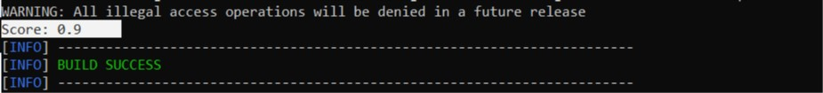

<b> This is a test Maven project </b>

<i> Here, the team can explore dependencies and change the local pom.xml file
without impacting the "real" project. </i>

More importantly, this project has much less overhead and compiles much faster
than the entire AppEngine.

Note that this directory compiles differently than the CodeU starter project
AppEngine. This code does not create a development server (again, for minimal
overhead when compiling). Instead, the mvn code must be compiled and then the
file being tested can be run.

<h1> Getting Started: </h1>

  - Usual git steps: make sure you are up to date on master, then create a new local branch

  - Change your working directory to test-project

  - Create or edit a file in "src\\main\\java\\com\\codeU\\demo"
     - <i> See SentimentTest.java as an example </i>

  - If you are working with a new library, add the needed dependency to pom.xml

  - Run `mvn compile` <i>to compile all files. If you have build errors, fix them then recompile </i>

  - Run `mvn exec:java -Dexec.mainClass="com.codeU.demo.[Filename without '.java']"`
    - <i> Example: `mvn exec:java -Dexec.mainClass="com.codeU.demo.SentimentTest"`

<i> Things printed to the console should show up just before "Build Success" </i>
Example: 
